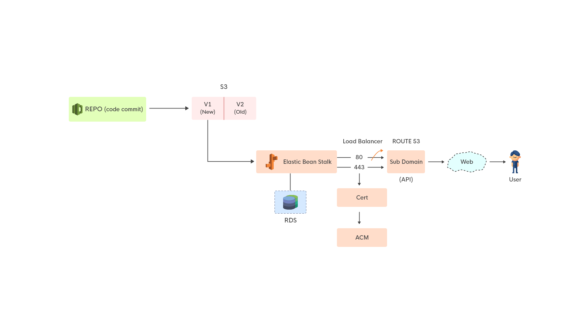

# To be written . . .
### Rough draft of things to be covered.
1. Cloning
2. Making changes and pushing
3. Data Pipeline (overview)

### Cloning and making changes to current workflow:  
The code pushes are auto enabled to make deployments on successful commits.
The current aws account with the full administrator access has to be availed and then necessary repository's http or ssh remote has to be copied.  
Once done, it has to be cloned in any local or remote environment using the credentials which will be available in the IAM section.

If code is being pulled, the application can be run in the local by setting up a similar local environment from the environment variables.  

Every time a change is commited and pushed to the repository, the codepipelines pulls the latest code from that branch.  
And pushes them into s3 for a version maintaince for reverting facility.  
The code is then pushed and verified successfully. If any changes, they are reverted back to the most recent running version.


### Data workflow:
All the applications such as op-api,op-ui, cdsp-ui, cdsp-api, master-registry-api, master-resgistry-ui follows a same workflow and is being pushed.

The workflow is being defined here:  



Please refer the image.  

The steps follow as below:  
1. Whenever, a code is pushed to the AWS repository, a trigger is initiated at the codepipeline which would have been created.
2. A copy of the current version which is pushed is saved to the s3 (for backup purpose).
3. Once done, the code is copied to the beanstalk application which is already configured to connect with the necessary dependencies security groups such as elasticache, rds etc.
4. The code from s3 is downloaded and a blue/green deployment or whatever is necessary is being run.
5. If the build is successfully replaced, then the previous version is deleted. 
6. The load balancers are enabled to receive traffic only through 443 and route all 80 traffic to 443.
7. The certificates for 443 to run are being generated from ACM.
8. A domain is mapped from route 53 hosted zones to make the EBS app available.
   
>The dockerfile for running a node-app using docker in EBS with a build stage is as follows:  
```docker
FROM node:12.0.0-alpine
RUN mkdir -p usr/src/app
WORKDIR /usr/src/app
COPY package.json package.json
RUN npm install --silent && npm cache clean --force
WORKDIR /usr/src/app
COPY . .
EXPOSE 8080
RUN npm run api-build
CMD ["npm","start"]
```

>The dockerfile for running a react app using docker in EBS with a build stage is as follows:  
```docker
FROM node:12.4.0-alpine as build  
WORKDIR /app  
ENV PATH /app/node_modules/.bin:$PATH  
COPY package.json /app/package.json   
RUN npm install --silent  
RUN npm install react-scripts -g --silent  
COPY . /app  
RUN npm run build  
# # production environment  
FROM nginx:latest  
COPY ./nginx/default.conf /etc/nginx/conf.d/default.conf  
COPY --from=build /app/build /usr/share/nginx/html  
EXPOSE 80  
CMD ["nginx", "-g", "daemon off;"] 
```

>The dockerfile for running a react app using docker in EBS without a build stage is as follows:  
```docker
FROM nginx:latest
COPY ./nginx/default.conf /etc/nginx/conf.d/default.conf
COPY  ./build /usr/share/nginx/html
EXPOSE 80
CMD ["nginx", "-g", "daemon off;"] 
```
