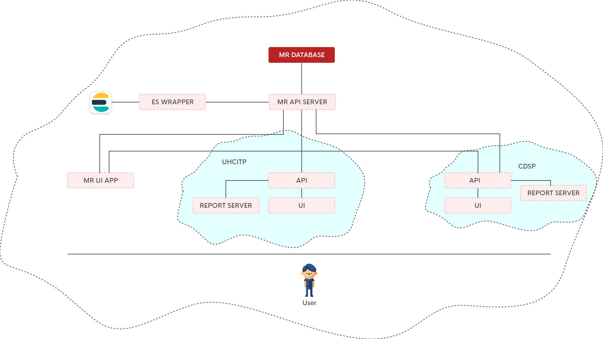
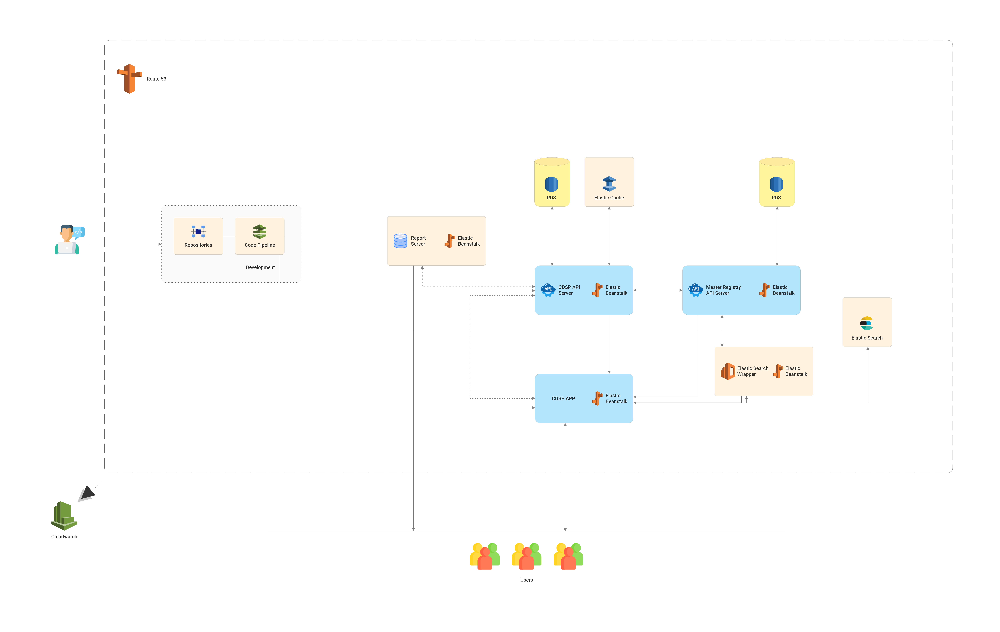

# To be written . . .  

# Over all arch
x
## AWS diagram 

#  UHC APP diagram  
## Services List:
The list of services used in uhc app is as follows:
1. codecommit(repository).
2. codepipeline(for triggers to EBS)
3. EBS(for running the environments which also uses ec2, s3 internally)
4. Load balancer(to route traffics).
5. route53 (for hosting domain records).
6. ACM (SSL certificates)
7. Elasticache(redis for in-memory storage)
8. RDS (app db storage).
9. s3 (file storages).
10. ses (smtp)
11. cloudfront (for caching static files)

## AWS diagram  

# CDSP app diagram:  
## Services List:
The list of services used in uhc app is as follows:
1. codecommit(repository).
2. codepipeline(for triggers to EBS)
3. EBS(for running the environments which also uses ec2, s3 internally)
4. Load balancer(to route traffics).
5. route53 (for hosting domain records).
6. ACM (SSL certificates)
7. RDS (app db storage)

## AWS Diagram

#  Master registry  
## Services List:
The list of services used in uhc app is as follows:
1. codecommit(repository).
2. codepipeline(for triggers to EBS)
3. EBS(for running the environments which also uses ec2, s3 internally)
4. Load balancer(to route traffics).
5. route53 (for hosting domain records).
6. ACM (SSL certificates)
7. RDS (app db storage).
8.  ses (smtp)

## AWS Diagram

#  Report Tool 
## Services List:
The list of services used in uhc app is as follows:
1. codecommit (repository).
2. codepipeline(for triggers to EBS)
3. EBS(for running the environments which also uses ec2, s3 internally)
4. Load balancer(to route traffics).
5. route53 (for hosting domain records).
6. ACM (SSL certificates)
7. RDS (app db storage).
8. s3 (file storages).
9. ses (smtp)
10. cloudfront (for caching static files)

## AWS diagram

